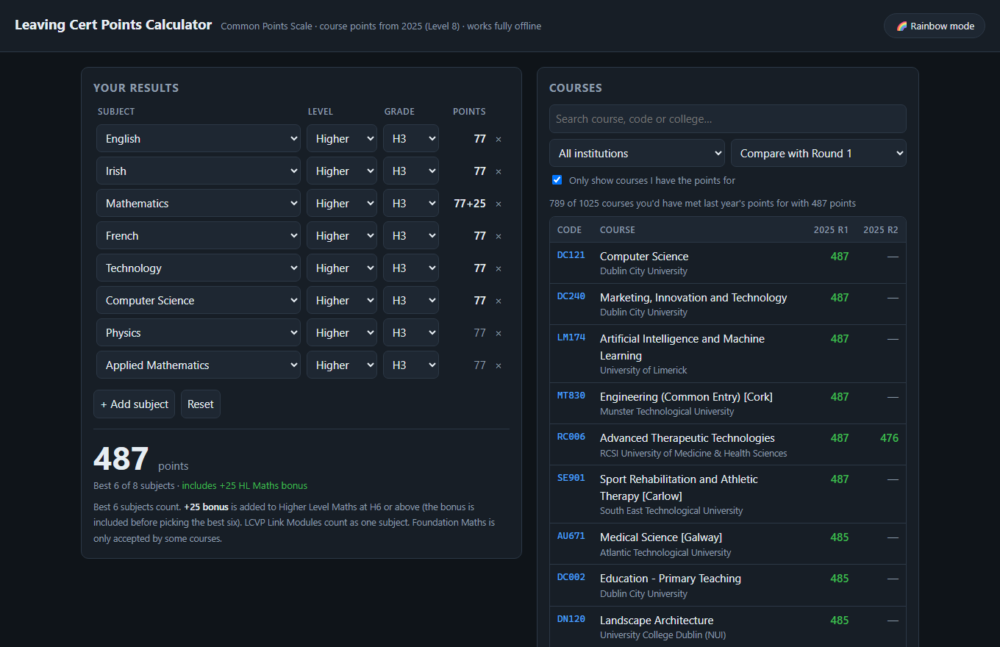
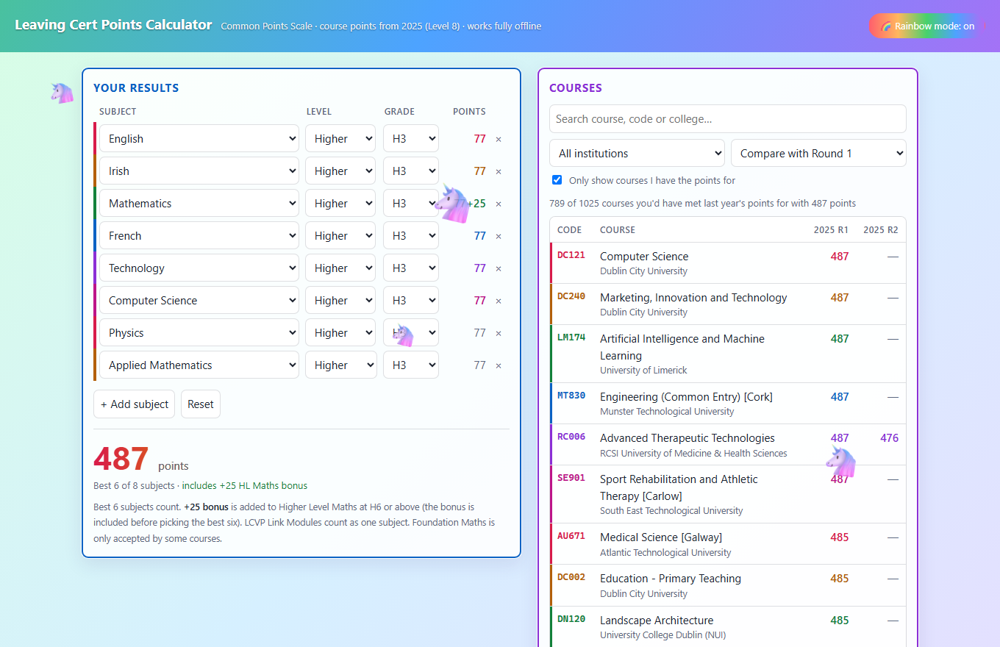

# Leaving Cert Points Calculator

A single-file, fully offline web app. Double-click [index.html](index.html) — no server, no internet, no
install. Everything (course data included) is embedded in that one file, so it keeps working if the CAO
site is down or you have no connection.

## What it does

- **Points calculator** — pick level and grade per subject, using the CAO Common Points Scale.
  Best 6 subjects count. The +25 Higher Level Maths bonus (H6 or better) is applied to the Maths
  score *before* the best six are chosen, which is how CAO does it. LCVP Link Modules and
  Foundation Maths are supported. Your entries are saved in the browser between visits.
- **Course lookup** — all 1,025 Level 8 courses from `data/LC2025_Points.htm` (29 institutions),
  filtered live to the ones your points would have got you last year. Search by course, code or
  college; filter by institution; compare against Round 1, Round 2, or the lowest round.
- **Rainbow mode** — the button in the top-right swaps the dark theme for a bright drifting pastel
  rainbow background, an animated gradient header, colour-cycled subject and course rows, a gradient
  points total, and a herd of dancing unicorns prancing across the screen. The setting sticks between
  visits, and all the animation is dropped if you have reduced-motion turned on.

## Notes on the data

Points shown are **2025** cut-offs and are a guide only — this year's will differ.

| Marker | Meaning |
| --- | --- |
| `#` | Test / interview / portfolio / audition also required |
| `*` | Not all applicants on this points score were offered places |
| `v` | New competition for available places |
| `AQA` | All qualified applicants admitted |
| `—` | No points listed (e.g. mature or graduate entry) |

Course titles are truncated in the source listing, so a few are cut off mid-word here too.

